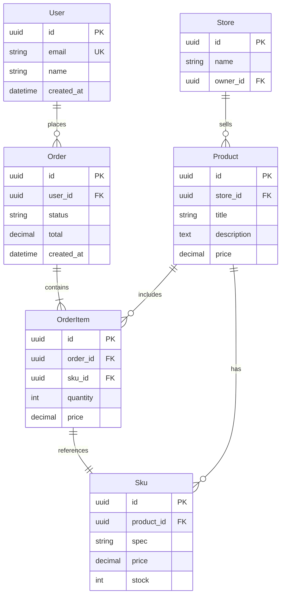

# AI 輔助資料庫設計與查詢最佳化

## 前言

資料庫設計往往是全端開發中最耗時也最難回頭的環節——ER 圖畫錯、索引漏加、查詢沒對到索引，等到上百萬筆資料進來才發現，遷移成本已不可承受。AI 的介入正在改變這個局面：從草稿階段的 Schema 生成，到上線後的查詢分析，AI 能讓資料庫設計從「經驗驅動」轉向「資料驅動」。

本文接續本期 Rust 生態的主題，聚焦如何將 AI 與 Rust 的資料庫工具鏈（SQLx、sqlx-cli、Explain 分析）結合，打造一個「AI 輔助資料庫工作流程」。

## 1. AI 輔助資料庫設計工具的現狀

目前市場上的 AI 資料庫工具大致可分為三類：

- **Schema 生成型**：輸入自然語言描述，輸出完整的 DDL 語句。代表工具如 Vanna AI、Chat2DB、以及各大 LLM 的程式碼生成功能。
- **查詢最佳化型**：自動擷取 EXPLAIN 計畫，分析瓶頸並給出索引建議。工具如 PostgreSQL 的 pg_analyze、EverSQL、以及 OtterTune。
- **遷移輔助型**：比對兩個 Schema 版本，自動生成 ALTER TABLE 指令。SQLx CLI 的 migrate 搭配 AI 可做到「描述變更原因 → 生成遷移檔」。

Rust 生態中，SQLx 是編譯期檢查的領頭羊，搭配 AI 可進一步消滅執行期的 SQL 錯誤。

## 2. 從自然語言到 ER 圖到 SQL Schema 的流程

一個典型的 AI 輔助設計流程如下：

```
使用者描述 → LLM 生成 ER 圖 (Mermaid) → LLM 生成 DDL → 手動審查 → SQLx migrate 導入
```

舉例來說，輸入：

> 「設計一個多店家電商平台，每個店家可以上架商品，商品可以有多個 SKU，使用者可以下單，訂單包含多個商品項目。」

AI 可以先輸出 Mermaid ER 圖：



## 3. AI 查詢最佳化：自動分析 EXPLAIN、建議索引

AI 真正的價值不在「寫 SQL」，而在「看 EXPLAIN」。一個查詢從 5 秒降到 5 毫秒，往往只需要一個正確的複合索引。

假設我們有這個查詢：

```sql
SELECT o.id, o.total, oi.sku_id, s.spec
FROM orders o
JOIN order_items oi ON oi.order_id = o.id
JOIN skus s ON s.id = oi.sku_id
WHERE o.user_id = 'abc-123'
  AND o.status = 'paid'
ORDER BY o.created_at DESC
LIMIT 20;
```

AI 分析 EXPLAIN 後可能給出：

```
❌ Sequential Scan on orders (cost=0.00..4521.30 rows=1)
   → 過濾條件 user_id = 'abc-123' AND status = 'paid'
   → 缺少複合索引

✅ 建議建立複合索引：
   CREATE INDEX idx_orders_user_status_created
   ON orders (user_id, status, created_at DESC);

✅ 建議涵蓋索引 (Covering Index)：
   CREATE INDEX idx_order_items_order_sku
   ON order_items (order_id) INCLUDE (sku_id, price);
```

關鍵原則：**一個複合索引的欄位順序應對應 WHERE 的選擇性順序**——選擇性最高的欄位放前面。AI 能從資料庫統計資訊自動推斷欄位的基數（cardinality）並排序。

## 4. SQLx + AI：AI 生成編譯期安全的 SQL

SQLx 的核心特色是 `cargo sqlx prepare` 會在編譯期檢查 SQL 語法與型別。但 SQLx 的 `query!` 巨集要求 SQL 在開發時就完整正確——這正好是 AI 的強項。

我們可以建立一個簡單的提示模板，讓 AI 輸出符合 SQLx 風格的參數化查詢：

```
請幫我撰寫一個 SQLx 相容的查詢：

資料表：
- users(id UUID PK, email VARCHAR, name VARCHAR, created_at TIMESTAMPTZ)
- orders(id UUID PK, user_id UUID FK, status VARCHAR, total NUMERIC)

需求：查詢某個使用者最近 10 筆已完成訂單，包含使用者名稱

限制：
1. 使用 $1, $2 等位置參數（SQLx 慣例）
2. 避免使用 ORM 包裝，寫純 SQL
3. 回傳欄位應與 Rust struct 的 derive(FromRow) 對應
```

AI 會輸出：

```sql
-- 對應的 Rust struct:
-- struct RecentOrders { id: Uuid, email: String, name: String, total: BigDecimal, created_at: DateTime<Utc> }

SELECT o.id, u.email, u.name, o.total, o.created_at
FROM orders o
JOIN users u ON u.id = o.user_id
WHERE o.user_id = $1
  AND o.status = 'completed'
ORDER BY o.created_at DESC
LIMIT $2;
```

而 Rust 端只需：

```rust
#[derive(Debug, FromRow)]
struct RecentOrders {
    id: Uuid,
    email: String,
    name: String,
    total: BigDecimal,
    created_at: DateTime<Utc>,
}

async fn recent_orders(pool: &PgPool, user_id: Uuid) -> Result<Vec<RecentOrders>> {
    let rows = sqlx::query_as::<_, RecentOrders>(
        "SELECT o.id, u.email, u.name, o.total, o.created_at
         FROM orders o
         JOIN users u ON u.id = o.user_id
         WHERE o.user_id = $1 AND o.status = 'completed'
         ORDER BY o.created_at DESC
         LIMIT $2"
    )
    .bind(user_id)
    .bind(10i64)
    .fetch_all(pool)
    .await?;

    Ok(rows)
}
```

AI 負責產生 SQL 字串，開發者只需貼入 `query_as!` 巨集中，`cargo sqlx prepare` 就會在編譯期驗證該 SQL 是否與實際資料庫吻合。

## 5. 實際案例：用 AI 設計一個電商資料庫

我們讓 AI 從頭生成一個完整的電商資料庫 Schema，並轉換為 SQLx 遷移檔。

**Step 1：AI 生成初始遷移**

```sql
-- 20260801000001_create_ecommerce_tables.sql
CREATE EXTENSION IF NOT EXISTS "uuid-ossp";

CREATE TYPE order_status AS ENUM ('pending', 'paid', 'shipped', 'completed', 'cancelled');

CREATE TABLE users (
    id         UUID PRIMARY KEY DEFAULT uuid_generate_v4(),
    email      VARCHAR(255) NOT NULL UNIQUE,
    name       VARCHAR(100) NOT NULL,
    created_at TIMESTAMPTZ  NOT NULL DEFAULT now()
);

CREATE TABLE stores (
    id         UUID PRIMARY KEY DEFAULT uuid_generate_v4(),
    owner_id   UUID NOT NULL REFERENCES users(id),
    name       VARCHAR(200) NOT NULL,
    slug       VARCHAR(100) NOT NULL UNIQUE,
    created_at TIMESTAMPTZ  NOT NULL DEFAULT now()
);

CREATE TABLE products (
    id          UUID PRIMARY KEY DEFAULT uuid_generate_v4(),
    store_id    UUID NOT NULL REFERENCES stores(id),
    title       VARCHAR(300) NOT NULL,
    description TEXT,
    base_price  NUMERIC(10,2) NOT NULL,
    created_at  TIMESTAMPTZ NOT NULL DEFAULT now()
);

CREATE TABLE skus (
    id          UUID PRIMARY KEY DEFAULT uuid_generate_v4(),
    product_id  UUID NOT NULL REFERENCES products(id),
    spec        VARCHAR(200) NOT NULL,
    price       NUMERIC(10,2) NOT NULL,
    stock       INT NOT NULL DEFAULT 0,
    created_at  TIMESTAMPTZ NOT NULL DEFAULT now()
);

CREATE TABLE orders (
    id          UUID PRIMARY KEY DEFAULT uuid_generate_v4(),
    user_id     UUID NOT NULL REFERENCES users(id),
    status      order_status NOT NULL DEFAULT 'pending',
    total       NUMERIC(12,2) NOT NULL DEFAULT 0,
    created_at  TIMESTAMPTZ NOT NULL DEFAULT now()
);

CREATE TABLE order_items (
    id         UUID PRIMARY KEY DEFAULT uuid_generate_v4(),
    order_id   UUID NOT NULL REFERENCES orders(id),
    sku_id     UUID NOT NULL REFERENCES skus(id),
    quantity   INT NOT NULL CHECK (quantity > 0),
    price      NUMERIC(10,2) NOT NULL,
    created_at TIMESTAMPTZ NOT NULL DEFAULT now()
);
```

**Step 2：AI 推薦初始索引**

```sql
-- 查詢使用者訂單
CREATE INDEX idx_orders_user_status ON orders (user_id, status);
-- 查詢店家的商品（管理後台常用）
CREATE INDEX idx_products_store ON products (store_id, created_at DESC);
-- 訂單明細關聯
CREATE INDEX idx_order_items_order ON order_items (order_id);
-- 商品 SKU 查詢
CREATE INDEX idx_skus_product ON skus (product_id);
-- 唯一商品 slug 加速
CREATE UNIQUE INDEX idx_stores_slug ON stores (slug);
```

**Step 3：AI 建議的 Rust 模型**

```rust
#[derive(Debug, sqlx::FromRow)]
pub struct OrderWithItems {
    pub order_id:   Uuid,
    pub status:     OrderStatus,
    pub total:      BigDecimal,
    pub created_at: DateTime<Utc>,
    pub items:      Vec<OrderItemView>,
}
```

搭配 `sqlx::query_as!` 與 `cargo sqlx prepare`，AI 生成的每一個欄位都會在編譯期被驗證。

## 6. AI 輔助資料庫遷移（Migration）生成

資料庫遷移是另一個 AI 能大幅減輕負擔的場景。傳統上開發者需要手動撰寫 `ALTER TABLE`、處理向下相容、考慮資料遷移腳本。AI 可以在給定「變更描述」後自動產出遷移檔。

範例輸入：

> 「訂單表需要加上 shipping_address 欄位（TEXT），並將 order_status 從 paid 之後自動觸發一個通知事件。另外 users 表需要加上 phone 欄位（VARCHAR(20)），並對 phone 建立唯一索引。」

AI 輸出：

```sql
-- 20260801000002_add_shipping_and_phone.sql
ALTER TABLE orders
    ADD COLUMN shipping_address TEXT;

ALTER TABLE users
    ADD COLUMN phone VARCHAR(20);

CREATE UNIQUE INDEX idx_users_phone ON users (phone);
```

遷移檔生成後，透過 sqlx-cli 執行：

```bash
sqlx migrate run
```

而反向遷移（down migration）也同樣可由 AI 生成：

```sql
-- 20260801000002_add_shipping_and_phone_down.sql
DROP INDEX IF EXISTS idx_users_phone;
ALTER TABLE users DROP COLUMN IF EXISTS phone;
ALTER TABLE orders DROP COLUMN IF EXISTS shipping_address;
```

這樣的流程讓 Schema 演進的每一步都有 AI 輔助產出的腳本，開發者只需審查而非從零撰寫。

## 7. 限制與挑戰：何時不該依賴 AI

AI 雖然強大，但在資料庫領域有幾個明顯的盲點：

**統計資訊缺失。** AI 無法知道你的資料分布——`status = 'cancelled'` 佔 5% 還是 80%，這會徹底改變索引策略。AI 建議的索引在理論上正確，但實務上仍需 `EXPLAIN ANALYZE` 驗證。

**上下文長度限制。** 大型專案的 Schema 可能上百張表，LLM 無法完整納入注意力範圍。這導致 AI 可能忽略已有的索引或約束，給出重複甚至衝突的建議。

**安全與權限。** AI 生成的遷移可能包含 `DROP COLUMN` 或 `RENAME` 等破壞性操作，在 production 環境中未經審查直接執行極度危險。**永遠不要讓 AI 直接操作 production 資料庫。**

**領域特定知識。** 部分商業邏輯無法從 Schema 推斷——例如 soft delete 的 `WHERE deleted_at IS NULL` 是否該加入所有查詢、多租戶的 tenant_id 過濾策略等，這些需要人類判斷。

## 結語

AI 不會取代資料庫管理員或後端工程師，但它能將 Schema 設計、查詢撰寫、遷移生成的速度提升一個數量級。在 Rust 生態中，SQLx 的編譯期檢查補足了 AI 「可能出錯」的短板——AI 負責產出，編譯器負責驗證，開發者負責審查與決策。這個三角協作模式，很可能是未來的標準工作流程。

下一期我們將探討 Rust 的非同步測試策略，包括如何用 `sqlx::test` 搭配 Testcontainers 進行資料庫整合測試。
